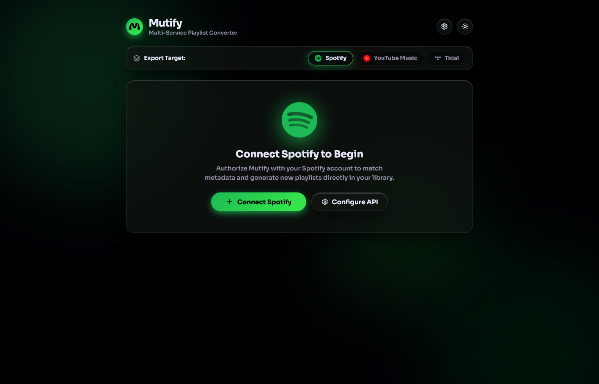
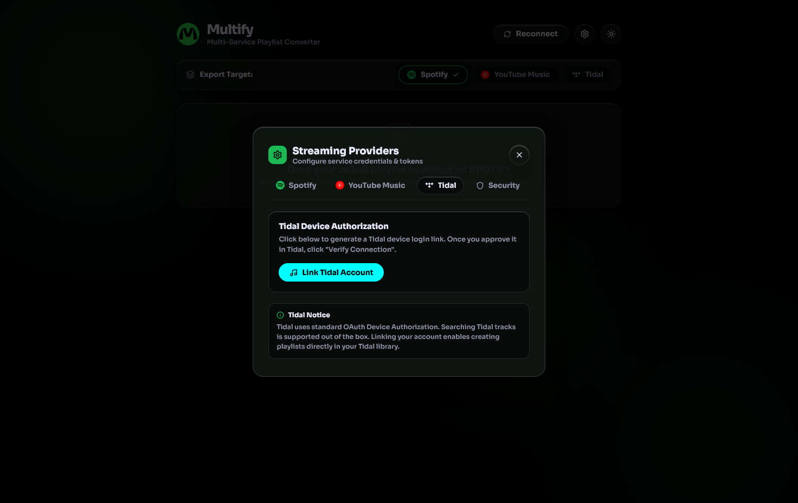

# Mutify

<p align="center">
  
</p>

<p align="center">
  <b>Modern Multi-Service Playlist Converter</b><br />
  <i>Seamlessly bridge local .m3u8 & .m3u playlists to Spotify, YouTube Music, and Tidal.</i>
</p>

<p align="center">
  
  
  
  
  
</p>

---

## Overview

**Mutify** is a high-performance, privacy-first playlist converter designed to import local music library playlists (`.m3u8` / `.m3u`) into your favorite cloud streaming services. With intelligent track metadata matching, studio album prioritization, guest search modes, and a stunning liquid glass interface, Mutify makes migrating and synchronizing playlists effortless.

---

## Screenshots & Interface

### 1. Landing Page & Multi-Service Hub
Select your target streaming service with dedicated glowing hero cards and direct dropzone import.

<p align="center">
  
</p>

---

### 2. Intelligent Matcher & Track Review
Live status badges, album art previews, and dropdown candidate selector with manual override and skip options.

<p align="center">
  
</p>

---

### 3. Provider Settings & Credentials
Tabbed credential management for Spotify OAuth, YouTube Music session headers, and Tidal device authorization.

<p align="center">
  
</p>

---

## Key Features

- **Multi-Service Destination**: Target **Spotify**, **YouTube Music**, or **Tidal** with full data isolation per service.
- **Intelligent Audio Ranking**: Filters out live bootlegs, karaoke versions, and instrumentals to favor original studio albums and official releases.
- **Instant Guest Search**: Search and test YouTube Music and Tidal catalogs out of the box with zero upfront credentials.
- **Manual Review & Dropdown Override**: Pick alternative match candidates or skip individual tracks before generating playlists.
- **Missing Track Exporter**: Export unmatched or skipped tracks into a clean `.txt` list for reference.
- **Fluid Liquid Glass Interface**: High-contrast dark and light modes, reactive ambient orbs, and a floating action dock.
- **Local & Secure**: All credentials, session tokens, and cache files stay 100% local on your machine.

---

## Supported Input Playlists

Mutify parses standard and extended `.m3u` / `.m3u8` playlist files exported from:
- **Navidrome / Subsonic**
- **iTunes / Apple Music**
- **Plex / Jellyfin**
- **VLC / Foobar2000 / Winamp**
- Local file directories (automatic filename metadata fallback)

---

## Quick Start

### Option A: Docker (Recommended)

Run Mutify instantly with Docker or Docker Compose without installing Python or dependencies:

#### Using Docker Compose
```bash
# Clone the repository
git clone https://github.com/your-username/mutify.git
cd mutify

# Start container in background
docker compose up -d
```

#### Using Docker CLI
```bash
# Build and run container
docker build -t mutify .
docker run -d -p 5099:5099 --name mutify mutify
```

Open **`http://127.0.0.1:5099`** in your browser.

---

### Option B: Local Python Installation

If you prefer running directly on your host machine:

```bash
# 1. Clone repository
git clone https://github.com/your-username/mutify.git
cd mutify

# 2. Install dependencies
pip install -r requirements.txt

# 3. Run application
python app.py
```

Navigate to **`http://127.0.0.1:5099`**.

---

## Streaming Provider Setup

### Spotify
1. Create an application on the [Spotify Developer Dashboard](https://developer.spotify.com/dashboard).
2. Set the **Redirect URI** to match your deployment:
   - **Local instance**: `http://127.0.0.1:5099/callback`
   - **Remote server / LAN**: `http://<YOUR_SERVER_IP>:5099/callback` (e.g. `http://192.168.1.100:5099/callback`)
   - **Domain / Reverse Proxy**: `https://<YOUR_DOMAIN>/callback`
3. Add your Spotify email under **User Management** in the developer dashboard.
4. In Mutify Settings, enter your **Client ID**, **Client Secret**, and ensure the **Redirect URI** matches the one configured in Spotify.

### YouTube Music
- **Guest Search**: Works out of the box with zero setup.
- **Playlist Creation**: Copy your cookie request headers from `music.youtube.com` (via browser DevTools Network tab) and paste them into the YouTube Music settings tab.

### Tidal
1. Open Mutify Settings, select **Tidal**, and click **Link Tidal Account**.
2. Click the authorization link to approve the device login on Tidal.
3. Click **Verify Connection** to store the session.

---

## Project Structure

```
mutify/
├── app.py                      # Flask server, OAuth routes, & API handlers
├── Dockerfile                  # Production container definition
├── docker-compose.yml          # One-command orchestration
├── requirements.txt            # Project dependencies
├── assets/                     # Official brand vector SVGs and UI screenshots
├── templates/
│   └── index.html              # React UI & Liquid Glass design system
└── providers/
    ├── __init__.py             # Abstract BaseProvider interface
    ├── registry.py             # Dynamic provider resolution
    ├── spotify_provider.py     # Spotify search & playlist creation
    ├── ytmusic_provider.py     # YouTube Music search & playlist creation
    └── tidal_provider.py       # Tidal device auth & playlist creation
```

---

## AI Assistance & Development

This codebase was designed and developed with **AI pair-programming assistance** using **Google Antigravity**, adhering to clean architectural patterns, provider abstraction layers, and modern UI/UX design standards.

---

## License

Distributed under the **GNU General Public License v3.0 (GPL-3.0)**. See [`LICENSE`](LICENSE) for more information.
